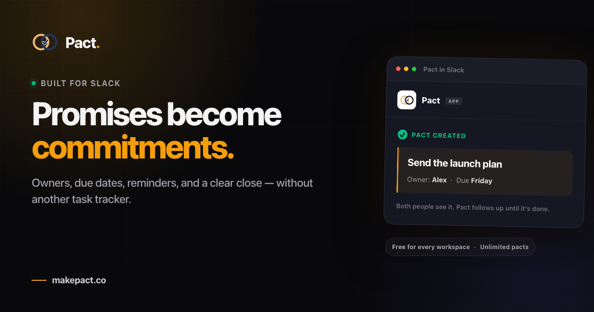

<p align="center">
  
</p>

<h1 align="center">Pact</h1>

<p align="center">
  <strong>Turn Slack promises into commitments that get done.</strong><br>
  Owners, due dates, reminders, and a clear close — without another task tracker.
</p>

<p align="center">
  <a href="https://makepact.co/slack/reinstall"><strong>Add to Slack</strong></a>
  · <a href="https://makepact.co">Website</a>
  · <a href="https://makepact.co/support">Support</a>
  · <a href="https://makepact.co/privacy">Privacy</a>
</p>

<p align="center">
  <a href="https://makepact.co">
    
  </a>
</p>

Pact is a free, open-source Slack app for shared accountability. A pact has an
owner, a teammate, and a due date. Pact keeps it visible with reminders and
overdue nudges, then gives both people a clear way to complete or reschedule it.

## How it works

1. **Create a pact** — use `/pact` in a teammate DM, react to a message with 🤝,
   or choose the message shortcut.
2. **Keep it visible** — Pact surfaces due-soon and overdue commitments in DMs,
   digests, and the Slack Home Tab.
3. **Close the loop** — use `/done`, react with ✅, reply in the thread, or
   complete several pacts from Home.

```text
/pact @sam review the launch plan by Friday
/pacts
/done 42
```

Run `/pact help` in Slack for the full command reference.

## What is included

### The commitment loop

- Shared pacts with owners, counterparties, and due dates
- Automatic reminders, overdue nudges, and daily or weekly digests
- Recurring commitments and two-way reschedule proposals
- Completion streaks, bulk actions, and a Slack Home Tab overview
- Editing, fuzzy completion matching, and natural-language date parsing

### Slack-native capture

- `/pact`, `/pacts`, and `/done` slash commands
- 🤝 and ✅ reaction workflows
- A “Make this a Pact” message shortcut
- Conversational bot DMs and Slack Workflow Builder steps

### Optional integrations

- AI-assisted commitment detection and `/done` suggestions through Anthropic
- Completion sync with Linear, Notion, or Asana
- Transactional email through Resend or a compatible HTTP endpoint

Every hosted Pact feature is free for every workspace: unlimited pacts and no
credit card.

## Run locally

### Prerequisites

- Node.js 20+
- PostgreSQL (Neon works well)
- A Slack app created from the checked-in manifest

```bash
npm install
cp .env.example .env
# Add DATABASE_URL and the required Slack credentials to .env
node --env-file=.env migrate.js
node --env-file=.env scripts/dev.js
```

Pact starts on `http://localhost:3000` unless `PORT` is set.

## Configuration

| Variable | Purpose |
| --- | --- |
| `DATABASE_URL` | Pooled PostgreSQL connection used by the app |
| `MIGRATE_DATABASE_URL` | Optional direct connection for migrations; falls back to `DATABASE_URL` |
| `SLACK_SIGNING_SECRET` | Verifies incoming Slack requests |
| `SLACK_CLIENT_ID` / `SLACK_CLIENT_SECRET` | Slack OAuth credentials |
| `SLACK_APP_ID` | Slack app ID used for App Home links |
| `SLACK_BOT_TOKEN` | Optional single-workspace development override |
| `APP_URL` / `APP_BASE_URL` | Public base URL for OAuth callbacks and links |
| `CRON_SECRET` | Bearer token for scheduled-job endpoints |
| `ANTHROPIC_API_KEY` | Enables optional AI-assisted features |
| `RESEND_API_KEY` / `EMAIL_FROM` | Enables optional email delivery through Resend |
| `LINEAR_*` / `NOTION_*` / `ASANA_*` | Enables optional tracker OAuth connections |
| `TRACKER_ENCRYPTION_KEY` | Encrypts stored tracker credentials |

See [`.env.example`](.env.example) for the complete template, including admin,
analytics, and alternative email settings.

## Slack app setup

[`slack-app-manifest.json`](slack-app-manifest.json) is the source of truth for
scopes, commands, events, and interactivity. Create or update your Slack app from
that manifest, then point these surfaces at your deployment:

- Events: `https://<host>/slack/events`
- Interactivity: `https://<host>/slack/actions`
- Slash commands: `https://<host>/slack/commands`
- OAuth redirect: `https://<host>/slack/oauth/callback`

The bot subscribes to `app_home_opened`, `message.im`, and `reaction_added`.
Keep Socket Mode disabled for a Vercel deployment.

## Development

```bash
npm test             # unit and consistency tests
npm run test:slack   # signed HTTP E2E checks against a running deployment
npm run build        # validates the no-build deployment contract
```

Unit tests use Node's built-in test runner and do not require live Slack or
database credentials. Slack E2E tests require `SLACK_SIGNING_SECRET`; optional
workspace tokens unlock additional DM coverage. See
[`tests/slack-e2e-runner.js`](tests/slack-e2e-runner.js) for supported settings.

## Architecture

Pact is a Node.js/Express app using Slack Bolt and PostgreSQL. It runs as one
Vercel handler, with protected scheduled work under `/api/crons/*`.

```text
server.js                 HTTP and application wiring
lib/slack-handlers.js     Slack commands, actions, and events
lib/home-tab.js           Slack Home Tab views and interactions
routes/                   Page and feature routes
db/                       PostgreSQL queries and connection management
schema.sql                Idempotent database schema
public/                   Website, dashboard, and policy pages
api/                      Vercel entry points
```

For production configuration and release checks, see
[`PRODUCTION_CHECKLIST.md`](PRODUCTION_CHECKLIST.md). For database handoff and
migration notes, see [`MIGRATION.md`](MIGRATION.md).

## Deploy

1. Configure the environment variables above in Vercel.
2. Run `npm run migrate`, using a direct database URL when available.
3. Deploy the Express handler with the included [`vercel.json`](vercel.json).
4. Update the Slack Events, Interactivity, Commands, and OAuth URLs.
5. Configure the included GitHub Actions scheduler with `PACT_BASE_URL` and
   `CRON_SECRET` when Vercel Cron is unavailable.

## License

[MIT](LICENSE)
